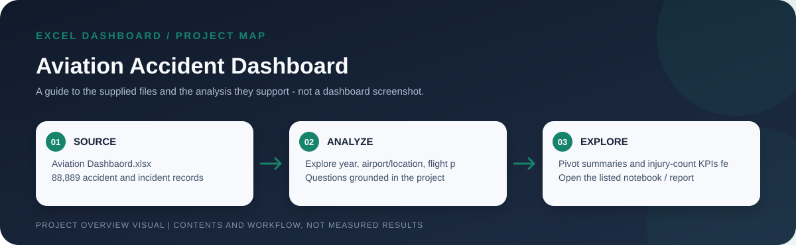
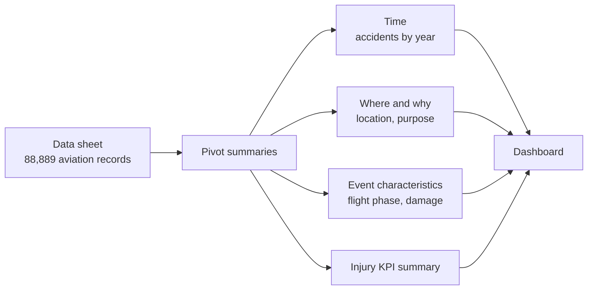

# Aviation Accident Dashboard

> Workflow illustration only; it is not a dashboard screenshot or a source of measured results.

> **Question:** What patterns appear in the supplied aviation accident records by year, airport/location, flight purpose, phase of flight, and aircraft damage?

This Excel project turns an **88,889-record** aviation dataset into a pivot-based dashboard and a set of supporting summaries. The goal is to make several dimensions of accident history explorable in one workbook, with headline injury totals and breakdowns that can guide deeper questions.

## Workbook snapshot

| Accident records | Fatal injuries recorded | Serious injuries recorded | Minor injuries recorded |
| ---: | ---: | ---: | ---: |
| **88,889** | **50,201** | **21,377** | **27,478** |

These are counts/sums stored in the workbook's KPI summary, not rates adjusted for flight volume or exposure.

## How the workbook is organized

## The file and its sheets

| File | What to explore |
| --- | --- |
| [`Aviation Dashbaord.xlsx`](<./Aviation Dashbaord.xlsx>) | The complete project workbook. `Dashboard` assembles the visual view; `KPI` contains accident and injury summaries; `Accident by Year`, `Location wise accident`, `Accidents by purpose of flight`, `Phase of flight`, and `Total Aircraft Damage` provide the supporting pivot tables; `Data` holds the 88,889-row source extract. The data includes event date/location, investigation type, injury severity, aircraft damage/category, make/model, purpose of flight, weather, and phase-of-flight fields. |

## Open and use

1. Download the workbook and open it in Microsoft Excel or a compatible spreadsheet application.
2. Start at `Dashboard`, then inspect the supporting pivot sheets to understand each comparison.
3. If you change or replace source data, refresh the pivot tables and check that the dashboard and KPI totals reconcile with the updated `Data` sheet.

## Interpretation notes

- Counts by airport, year, purpose, or phase are counts of records in this workbook, not per-flight accident probabilities.
- Injury totals are not normalized for exposure, aircraft occupancy, or flight hours.
- The workbook's reporting date range/source provenance should be checked in the data before describing the analysis as current.
- Accident records can include missing or unknown classifications; use the supporting categories and filters rather than treating unknown as zero.
