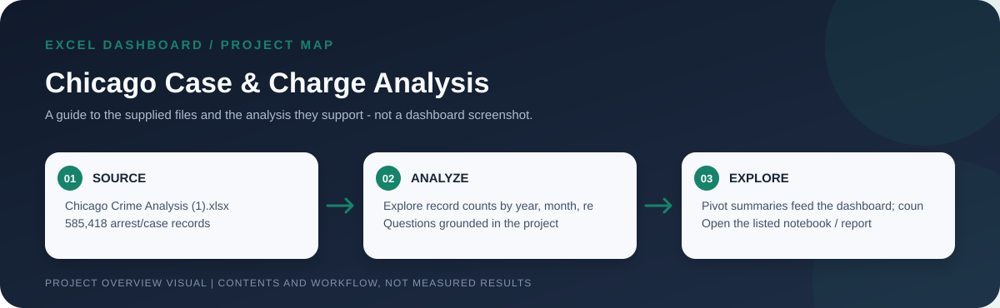

# Chicago Arrest & Charge Records



> Workflow illustration only; it is not a dashboard screenshot or a source of measured results.


> **Question:** How do the case/arrest records in this workbook vary over time and across recorded race and charge-description categories?

This Excel analysis summarizes **585,418 rows** of Chicago case/arrest records. Pivot summaries and a dashboard organize the records by year, month, race, and charge description, helping a reader explore how the supplied records are distributed.

> **Important:** The workbook contains arrest-date, case-number, and charge fields. Its counts describe records in this extract-not all crime incidents, population-adjusted crime rates, or evidence that race causes criminal behavior.

## Workbook overview

```mermaid
flowchart LR
    A[Data sheet<br/>585,418 rows] --> B[Pivot summaries]
    B --> C[Time patterns<br/>year  |  month]
    B --> D[Recorded attributes<br/>race  |  charge description]
    B --> E[Record and charge totals]
    C --> F[Dashboard]
    D --> F
    E --> F
```

## The file and its sheets

| File | What to explore |
| --- | --- |
| [`Chicago Crime Analysis (1).xlsx`](<./Chicago Crime Analysis (1).xlsx>) | The complete project workbook. `Dashboard` presents the summaries; `Total Cases` holds record/charge totals; `By Year` and `By Month` summarize dates; `Race` groups the workbook's race field; `Charge Description` summarizes charge text; and `Data` holds the underlying 585,418 records. The source sheet includes case number, arrest date, dates, race, and up to four charge/statute fields. |

## Open and refresh

Open the `.xlsx` file in Excel. Review the `Dashboard` and supporting summary sheets, then inspect `Data` to understand the included fields and coverage. If the source data changes, refresh the pivot tables and verify that the summary totals match the refreshed source.

## Responsible interpretation and data caveats

- These are case/arrest-record counts; they are not a complete measure of criminal activity in Chicago.
- The workbook does not provide population denominators, enforcement exposure, or other context needed for fair demographic rate comparisons.
- Race and charge-description summaries are descriptive categories in the supplied extract and do not establish cause or individual behavior.
- Case-level and charge fields may contain multiple charges or repeated case identifiers. Do not treat every row or charge as an independent person or unique incident without validating the underlying grain.
- Confirm the date coverage, source agency, inclusion criteria, and refresh date from the workbook/source before citing results.
