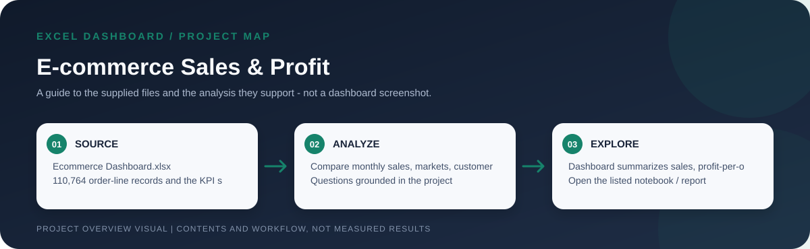
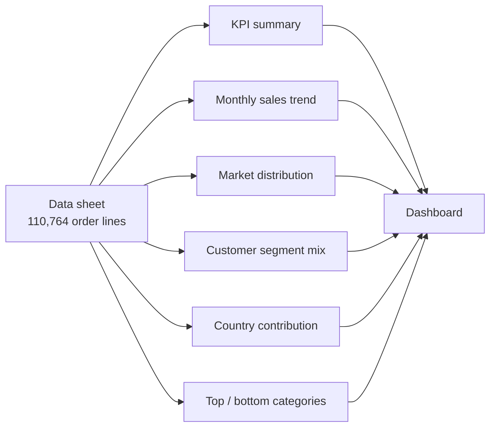

# E-commerce Sales & Profit Dashboard

> Workflow illustration only; it is not a dashboard screenshot or a source of measured results.

> **Question:** How are sales, profit, and order quantity distributed across months, markets, customer segments, countries, and product categories?

This workbook contains **110,764 order-line records** and a dashboard built around sales, profit-per-order, quantity, and margin. It supports an interactive-style business overview through prebuilt pivot summaries and charts, with country, market, segment, monthly, and top/bottom-category views.

## KPI snapshot

| Sales | Profit per order | Order quantity | Average profit margin |
| ---: | ---: | ---: | ---: |
| **26.47M** | **2.50M** | **284,209** | **10.86%** |

The workbook does not specify a currency next to these summary amounts. Treat them as source-data units until the source currency is confirmed.

## Dashboard flow

## The file and its sheets

| File | What to explore |
| --- | --- |
| [`Ecommerce Dashboard.xlsx`](<./Ecommerce Dashboard.xlsx>) | The complete dashboard and its source data. `Dashboard` assembles the report; `KPI` stores sales/profit/quantity/margin totals; `Trend Line` breaks sales down by month; `Market Distribution`, `Customer Segment`, and `Country` provide geographic and customer views; `Top 5` compares the largest and smallest categories; and `Data` contains the 110,764 source order lines. Fields include order date/ID/status/quantity, sales, profit and margin, product category, market/region/country, shipping mode, and customer segment. |

## Open and refresh

Open the workbook in Microsoft Excel. Start with `Dashboard`; use the underlying summary sheets to trace its metrics and categories. Refresh pivot tables after changing the `Data` sheet, and check that the report totals reconcile.

## Definitions and limitations

- The workbook labels the measure `Sum of Profit Per Order`; it is not necessarily the same as audited accounting profit.
- "Sales," "Profit Per Order," and `Order Quantity` are aggregated as stored. Check the source definitions before comparing with another system.
- The currency and time coverage are not stated in this README; verify the `Data` sheet/source before interpreting amounts as a specific currency or current performance.
- Country and market comparisons are descriptive, not causal. Top/bottom groups depend on the workbook's pivot configuration and filters.
