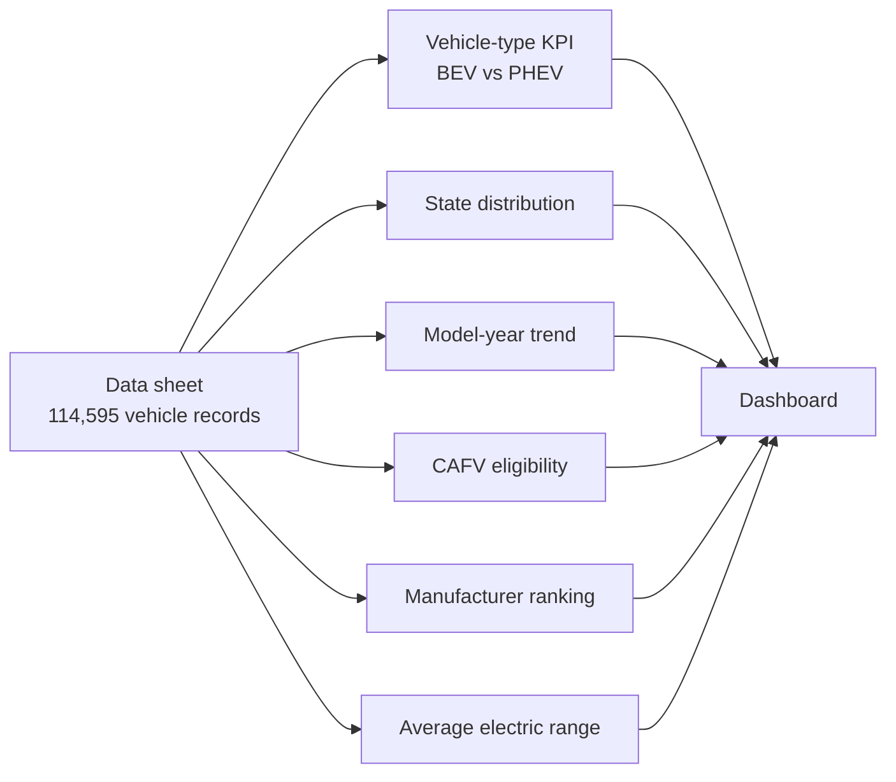

# Electric Vehicle Population Dashboard

> Workflow illustration only; it is not a dashboard screenshot or a source of measured results.

> **Question:** What does the supplied electric-vehicle registration snapshot show about vehicle type, model year, state, manufacturer, electric range, and eligibility classification?

This workbook summarizes **114,595 vehicle records** and organizes them into a dashboard with a KPI view and pivot summaries. It is useful for exploring the composition of this dataset-not as a live count of vehicles on the road or a measure of new sales.

## Snapshot KPIs

| Vehicle records | Battery electric (BEV) | Plug-in hybrid (PHEV) | CAFV eligible* |
| ---: | ---: | ---: | ---: |
| **114,595** | **87,767 (76.59%)** | **26,828 (23.41%)** | **58,063 (50.67%)** |

\* The source classifies a further **41,645 records (36.34%)** as "Eligibility unknown as battery range has not been researched"; **14,887 (12.99%)** are classified as not eligible due to low battery range. These are dataset labels, not a fresh eligibility determination.

## Dashboard flow

## The file and its sheets

| File | What to explore |
| --- | --- |
| [`Electric Vehicle Dashboard.xlsx`](<./Electric Vehicle Dashboard.xlsx>) | The complete workbook. `Dashboard` assembles the report; `KPI` splits records by BEV/PHEV; `State wise` summarizes state counts; `Model Year` compares model years; `CAFV` groups the eligibility labels; `top 10 by model` contains a manufacturer-level ranking; `Model by Avg` compares average electric range by manufacturer; and `Data` holds 114,595 records. Fields include state/county/city, model year, make/model, EV type, CAFV eligibility, electric range, MSRP, and vehicle-location information. |

## Open and explore

Open the `.xlsx` workbook in Excel. Start with the dashboard, then use the named summary tabs to trace its breakdowns. Refresh pivot tables if the source sheet is replaced, and confirm that all category totals reconcile to the number of records.

## Interpretation notes

- Counts are rows/vehicle records in the workbook. The `VIN (1-10)` field is a partial identifier; validate uniqueness before treating the row count as a count of distinct vehicles.
- The snapshot date and source refresh date are not documented here; do not present the workbook as real-time registrations or sales.
- CAFV eligibility includes a substantial unknown category. Do not silently classify unknown records as either eligible or ineligible.
- State or manufacturer totals depend on the records and geographic coverage in the supplied workbook; they are not population-normalized adoption rates.
